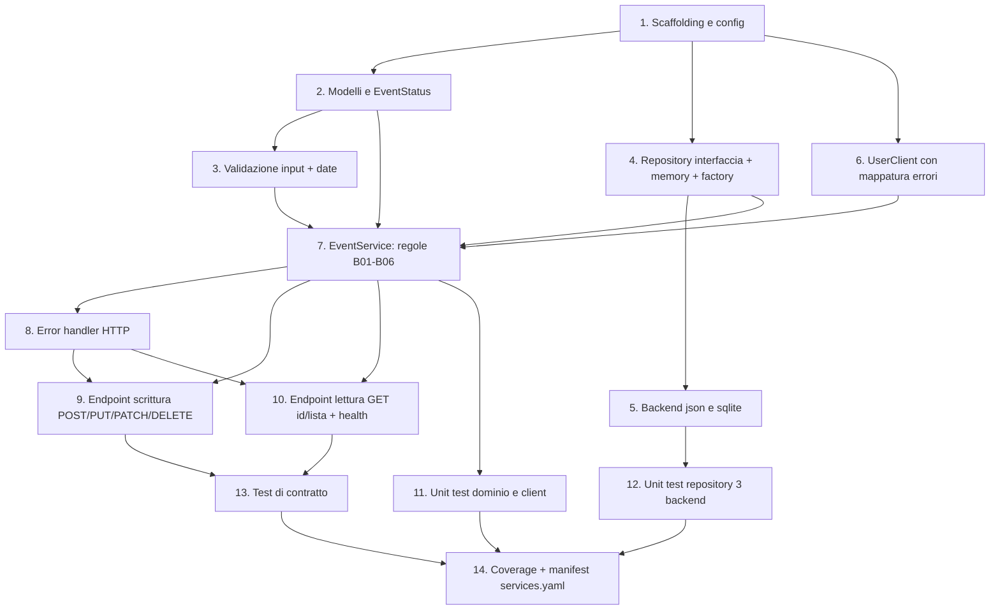

# Implementation Plan — event-service

Task atomici per implementare `event-service` seguendo `design.md` e `requirements.md`.
Un commit per task: `feat(event): <descrizione> [T-xx]`.

## Task Dependency Graph



Le "wave" raggruppano i task eseguibili in parallelo (stesso livello topologico):

```json
{
  "waves": [
    { "wave": 1, "tasks": [1] },
    { "wave": 2, "tasks": [2, 4, 6] },
    { "wave": 3, "tasks": [3, 5] },
    { "wave": 4, "tasks": [7] },
    { "wave": 5, "tasks": [8, 11, 12] },
    { "wave": 6, "tasks": [9, 10] },
    { "wave": 7, "tasks": [13] },
    { "wave": 8, "tasks": [14] }
  ]
}
```

## Tasks

- [ ] 1. Scaffolding del servizio e configurazione
  - Creare `services/event-service/` con `app/__init__.py`, `app/__main__.py`,
    `requirements.txt`.
  - `app/config.py`: env `PORT`, `STORAGE_BACKEND`, `DATA_DIR`, `USER_SERVICE_URL`.
  - _Requirements: REQ-EVT-C01, REQ-EVT-P01_

- [ ] 2. Modelli di dominio
  - `app/domain/models.py`: dataclass `Event`, enum `EventStatus`, helper id/timestamp.
  - _Requirements: REQ-EVT-F01_

- [ ] 3. Validazione input
  - `app/domain/validation.py`: `EventCreate`/`EventUpdate` secondo contratto (campi,
    lunghezze, range capacity/price, campi extra) + coerenza `end_date >= start_date`.
  - _Requirements: REQ-EVT-F01, REQ-EVT-B03, REQ-EVT-C01_

- [ ] 4. Interfaccia repository e backend memory
  - `app/repository/base.py`, `memory.py`, `factory.py`.
  - _Requirements: REQ-EVT-P01_

- [ ] 5. Backend json e sqlite
  - `app/repository/json_repo.py`, `sqlite_repo.py`.
  - _Requirements: REQ-EVT-P01_

- [ ] 6. Client verso user-service
  - `app/clients/user_client.py`: `get_user(id)`, timeout 2s, mappatura 404→assente,
    timeout/rifiuto/5xx → `DependencyUnavailable`.
  - _Requirements: REQ-EVT-B01, REQ-EVT-B05, REQ-EVT-C01_

- [ ] 7. Servizio di dominio e regole di business
  - `app/domain/service.py` (`EventService`): valida organizzatore (B01/B02), date (B03),
    transizioni di stato (B04), dipendenza giù (B05), filtri lista (B06).
  - _Requirements: REQ-EVT-B01, REQ-EVT-B02, REQ-EVT-B03, REQ-EVT-B04, REQ-EVT-B05, REQ-EVT-B06_

- [ ] 8. Gestione errori HTTP
  - `app/api/errors.py`: 400, 422 (VALIDATION_ERROR/REFERENCE_NOT_FOUND/INVALID_ORGANIZER/
    INVALID_STATUS_TRANSITION), 404, 405, 503 DEPENDENCY_UNAVAILABLE.
  - _Requirements: REQ-EVT-C01, REQ-EVT-B05_

- [ ] 9. Endpoint di scrittura (POST/PUT/PATCH/DELETE)
  - `app/api/events.py`: POST (201+Location), PUT/PATCH (200), DELETE (204), 404/422/503.
  - _Requirements: REQ-EVT-F01, REQ-EVT-F04, REQ-EVT-F05, REQ-EVT-F06_

- [ ] 10. Endpoint di lettura e health
  - GET id (200/404), GET lista (paginazione + filtri status/city, 422 su invalidi),
    `GET /health`.
  - _Requirements: REQ-EVT-F02, REQ-EVT-F03, REQ-EVT-F07, REQ-EVT-B06_

- [ ] 11. Unit test dominio e client
  - Validazione/date/transizioni; `UserClient` con `responses` (200/404/timeout/5xx).
  - _Requirements: REQ-EVT-B01, REQ-EVT-B02, REQ-EVT-B03, REQ-EVT-B04, REQ-EVT-B05_

- [ ] 12. Unit test repository sui tre backend
  - Batteria parametrizzata memory/json/sqlite (`tmp_path`).
  - _Requirements: REQ-EVT-P01_

- [ ] 13. Test di contratto per ogni endpoint
  - `assert_matches_contract` per POST, GET id, GET lista, PUT, PATCH, DELETE, health.
  - _Requirements: REQ-EVT-C01_

- [ ] 14. Coverage e manifest
  - Coverage ≥ 80%; aggiungere la voce `event` in `services.yaml`.
  - _Requirements: REQ-EVT-C01, REQ-EVT-P01_
