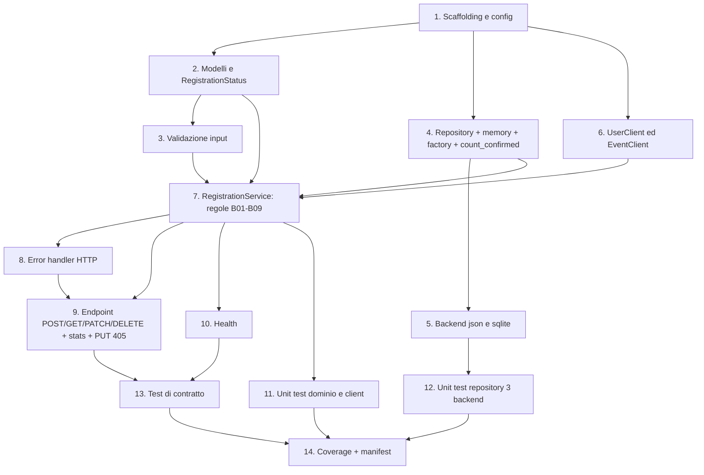

# Implementation Plan — registration-service

Task atomici. Un commit per task: `feat(registration): <descrizione> [T-xx]`.

## Task Dependency Graph



```json
{
  "waves": [
    { "wave": 1, "tasks": [1] },
    { "wave": 2, "tasks": [2, 4, 6] },
    { "wave": 3, "tasks": [3, 5] },
    { "wave": 4, "tasks": [7] },
    { "wave": 5, "tasks": [8, 10, 11, 12] },
    { "wave": 6, "tasks": [9] },
    { "wave": 7, "tasks": [13] },
    { "wave": 8, "tasks": [14] }
  ]
}
```

## Tasks

- [x] 1. Scaffolding e config
  - `services/registration-service/` con app package, `__main__`, `requirements.txt`.
  - `config.py`: `PORT`, `STORAGE_BACKEND`, `DATA_DIR`, `USER_SERVICE_URL`, `EVENT_SERVICE_URL`.
  - _Requirements: REQ-REG-C01, REQ-REG-P01_

- [x] 2. Modelli di dominio
  - `Registration`, `RegistrationStatus`, helper id/timestamp.
  - _Requirements: REQ-REG-F01_

- [x] 3. Validazione input
  - `RegistrationCreate` (solo `user_id`/`event_id`), `RegistrationPatch` (solo `status`),
    rifiuto campi extra e read-only.
  - _Requirements: REQ-REG-F01, REQ-REG-F04, REQ-REG-C01_

- [x] 4. Repository interfaccia + memory + factory
  - `add/get/list/update/delete/count_confirmed/find_confirmed`.
  - _Requirements: REQ-REG-P01, REQ-REG-B04, REQ-REG-B05_

- [x] 5. Backend json e sqlite
  - _Requirements: REQ-REG-P01_

- [x] 6. Client verso user ed event
  - `UserClient.get_user`, `EventClient.get_event`; timeout 2s; 404→None; timeout/5xx→503.
  - _Requirements: REQ-REG-B01, REQ-REG-B02, REQ-REG-B09, REQ-REG-C01_

- [x] 7. Servizio di dominio e regole di business
  - B01/B02 esistenza, B03 EVENT_NOT_OPEN, B04 ALREADY_REGISTERED, B05 EVENT_FULL,
    B06 amount=price, B07 transizioni, B08 stats, B09 dipendenza giù.
  - _Requirements: REQ-REG-B01, REQ-REG-B02, REQ-REG-B03, REQ-REG-B04, REQ-REG-B05, REQ-REG-B06, REQ-REG-B07, REQ-REG-B08, REQ-REG-B09_

- [x] 8. Gestione errori HTTP
  - 400, 422 (VALIDATION_ERROR/REFERENCE_NOT_FOUND/EVENT_NOT_OPEN/INVALID_STATUS_TRANSITION),
    409 (ALREADY_REGISTERED/EVENT_FULL), 404, 405, 503.
  - _Requirements: REQ-REG-C01, REQ-REG-B09_

- [x] 9. Endpoint HTTP
  - POST (201+Location), GET id, GET lista (filtri user_id/event_id/status), PATCH (status),
    DELETE (204), `GET /stats?event_id=`, `PUT /{id}` → 405.
  - _Requirements: REQ-REG-F01, REQ-REG-F02, REQ-REG-F03, REQ-REG-F04, REQ-REG-F05, REQ-REG-F06, REQ-REG-B08_

- [x] 10. Health check
  - `GET /health`.
  - _Requirements: REQ-REG-F07_

- [x] 11. Unit test dominio e client
  - _Requirements: REQ-REG-B01, REQ-REG-B03, REQ-REG-B04, REQ-REG-B05, REQ-REG-B06, REQ-REG-B07, REQ-REG-B09_

- [x] 12. Unit test repository sui tre backend
  - _Requirements: REQ-REG-P01_

- [x] 13. Test di contratto per ogni endpoint
  - POST, GET id, GET lista, PATCH, DELETE, stats, health; PUT→405.
  - _Requirements: REQ-REG-C01_

- [x] 14. Coverage e manifest
  - Coverage ≥ 80%; voce `registration` in `services.yaml`.
  - _Requirements: REQ-REG-C01, REQ-REG-P01_
