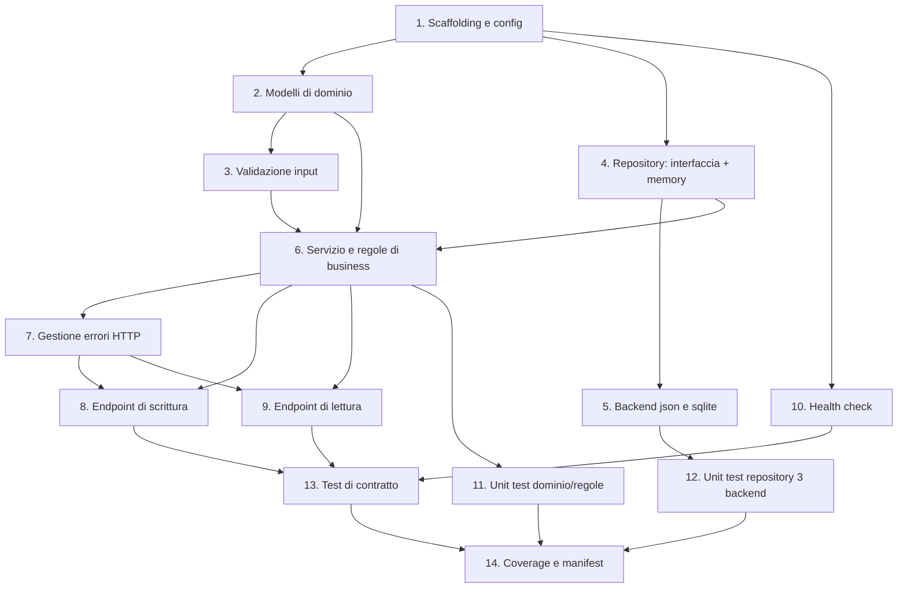

# Implementation Plan — user-service

Task atomici per implementare `user-service` seguendo `design.md` e `requirements.md`.
Ogni task è tracciato ai requisiti. Da eseguire uno alla volta da Kiro ("Start task"), con
un commit per task: `feat(user): <descrizione> [T-xx]`.

## Task Dependency Graph

Il grafo mostra l'ordine di esecuzione: un task può iniziare solo dopo i suoi predecessori.



Dipendenze in sintesi:

- **T1** non ha predecessori (base del progetto).
- **T2, T3** dipendono dal dominio/config; **T4→T5** costruiscono la persistenza.
- **T6** (regole di business) richiede modelli, validazione e repository.
- **T7, T8, T9** (livello HTTP) dipendono dal servizio di dominio (e dagli errori per 8/9).
- **T11–T13** (test) seguono le rispettive parti implementate.
- **T14** è finale: coverage e manifest dopo che tutto è implementato e testato.

Le "wave" raggruppano i task eseguibili in parallelo (stesso livello topologico):

```json
{
  "waves": [
    { "wave": 1, "tasks": [1] },
    { "wave": 2, "tasks": [2, 4, 10] },
    { "wave": 3, "tasks": [3, 5] },
    { "wave": 4, "tasks": [6] },
    { "wave": 5, "tasks": [7, 11, 12] },
    { "wave": 6, "tasks": [8, 9] },
    { "wave": 7, "tasks": [13] },
    { "wave": 8, "tasks": [14] }
  ]
}
```

## Tasks

- [x] 1. Scaffolding del servizio e configurazione
  - Creare `services/user-service/` con `app/__init__.py` (factory `create_app`),
    `app/__main__.py` (legge `PORT`, avvia il server) e `requirements.txt` (flask, requests).
  - Implementare `app/config.py` come unico punto di lettura delle env:
    `PORT`, `STORAGE_BACKEND` (default `memory`), `DATA_DIR` (default `./data`).
  - _Requirements: REQ-USR-C01, REQ-USR-P01_

- [x] 2. Modelli di dominio
  - Definire `app/domain/models.py`: dataclass `User` e enum `Role`
    (`attendee`/`speaker`/`organizer`).
  - Helper per `id` UUID v4 e timestamp ISO 8601 UTC (`created_at`/`updated_at`).
  - _Requirements: REQ-USR-F01_

- [x] 3. Validazione input
  - Implementare `app/domain/validation.py` per `UserCreate` e `UserUpdate` secondo il
    contratto: campi ammessi, `minLength`/`maxLength`, `format: email`, enum `Role`,
    rifiuto dei campi extra (`additionalProperties: false`) e dei campi read-only.
  - Produrre errori `422 VALIDATION_ERROR` con `details` per campo.
  - _Requirements: REQ-USR-F01, REQ-USR-C01_

- [x] 4. Interfaccia repository e backend memory
  - Definire `app/repository/base.py` (`UserRepository`) con
    `add/get/list/replace/update/delete/find_by_email`.
  - Implementare `app/repository/memory.py`.
  - Implementare `app/repository/factory.py` (`build_repository(config)`).
  - _Requirements: REQ-USR-P01_

- [x] 5. Backend json e sqlite
  - Implementare `app/repository/json_repo.py` (file in `DATA_DIR`, stdlib `json`).
  - Implementare `app/repository/sqlite_repo.py` (stdlib `sqlite3`, file in `DATA_DIR`,
    email indicizzata per ricerca case-insensitive).
  - Garantire comportamento identico ai tre backend.
  - _Requirements: REQ-USR-P01_

- [x] 6. Servizio di dominio e regole di business
  - Implementare `app/domain/service.py` (`UserService`): orchestrazione
    validazione→repo, generazione `id`/timestamp.
  - B01 email univoca case-insensitive → `409 EMAIL_ALREADY_EXISTS` (eccezione stesso id).
  - B02 email normalizzata in minuscolo in scrittura e in lettura.
  - B03 filtri lista per `role`/`email` (case-insensitive), in AND.
  - _Requirements: REQ-USR-B01, REQ-USR-B02, REQ-USR-B03_

- [x] 7. Gestione errori HTTP
  - Implementare `app/api/errors.py`: handler centralizzati per 400 `MALFORMED_JSON`,
    422 `VALIDATION_ERROR`, 409 `EMAIL_ALREADY_EXISTS`, 404 `NOT_FOUND`, 405.
  - Formato `{"error": {"code", "message", "details"}}`.
  - _Requirements: REQ-USR-C01_

- [x] 8. Endpoint di scrittura (POST/PUT/PATCH/DELETE)
  - Implementare in `app/api/users.py`: POST (201 + header `Location`, default
    `role=attendee`), PUT (200), PATCH (200, campi parziali), DELETE (204).
  - Aggiornare `updated_at` su PUT/PATCH; gestire 404 su id inesistente e 409 su email.
  - _Requirements: REQ-USR-F01, REQ-USR-F04, REQ-USR-F05, REQ-USR-F06_

- [x] 9. Endpoint di lettura (GET id / GET lista)
  - GET `/api/v1/users/{id}` (200/404).
  - GET `/api/v1/users` con paginazione (`page`/`page_size`, default 1/20, max 100) e
    filtri `role`/`email`; 422 su parametri non validi.
  - _Requirements: REQ-USR-F02, REQ-USR-F03, REQ-USR-B03_

- [x] 10. Health check
  - Implementare `app/api/health.py`: `GET /health` →
    `200 {"status": "ok", "service": "user-service"}`.
  - _Requirements: REQ-USR-F07_

- [x] 11. Unit test del dominio e delle regole di business
  - `tests/unit/`: creazione/validazione (F01–F06), B01 (incl. eccezione stesso utente),
    B02 (lowercase), B03 (filtri), generazione id/timestamp.
  - Marker `@pytest.mark.req("REQ-USR-...")` o ID nel nome/docstring.
  - _Requirements: REQ-USR-F01, REQ-USR-F02, REQ-USR-F03, REQ-USR-F04, REQ-USR-F05, REQ-USR-F06, REQ-USR-B01, REQ-USR-B02, REQ-USR-B03_

- [x] 12. Unit test del repository sui tre backend
  - Batteria parametrizzata su `memory`/`json`/`sqlite` (con `tmp_path` per json/sqlite):
    add/get/list/replace/update/delete/find_by_email e paginazione.
  - _Requirements: REQ-USR-P01_

- [x] 13. Test di contratto per ogni endpoint
  - Almeno 1 test per endpoint con
    `assert_matches_contract("user", method, path, response)`:
    POST, GET id, GET lista, PUT, PATCH, DELETE, health.
  - _Requirements: REQ-USR-C01_

- [x] 14. Coverage e manifest
  - Verificare coverage ≥ 80% (`pytest --cov=app`).
  - Aggiungere la voce `user` in `services.yaml` (`cwd: services/user-service`,
    `command: python -m app`).
  - _Requirements: REQ-USR-C01, REQ-USR-P01_
